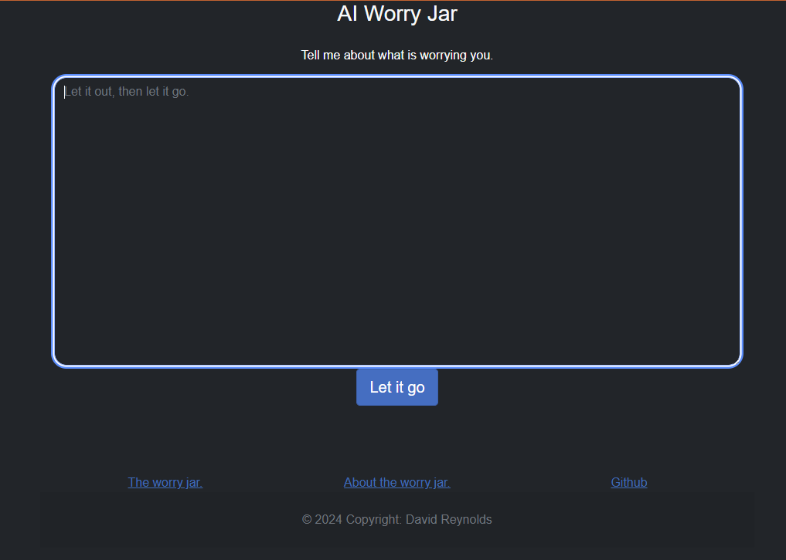

# AIWorryJar

The AI-Based Worry Jar is a comforting digital companion designed to alleviate stress and anxiety. By typing in your worries, you’ll receive personalized responses from an AI powered by OpenAI’s ChatGPT. This project combines the power of natural language processing with the Blazor framework (using C#) to create an interactive and supportive experience.

> Note: This ReadMe was also created with GPT.

## Features

- Worry Input: Users can express their worries or concerns by typing them into the application.
- AI Comfort: The worry jar leverages OpenAI’s ChatGPT to provide empathetic and reassuring responses.
- Blazor Interface: The user interacts with the worry jar through a Blazor web interface.
- Privacy: No worries are stored or shared; the AI responds in real time without retaining any personal information.

# Acknowledgments

- This project was inspired by the concept of a physical worry jar, where individuals write down their worries and place them in a jar for later reflection.
- Thanks to the OpenAI team for providing the ChatGPT model.
